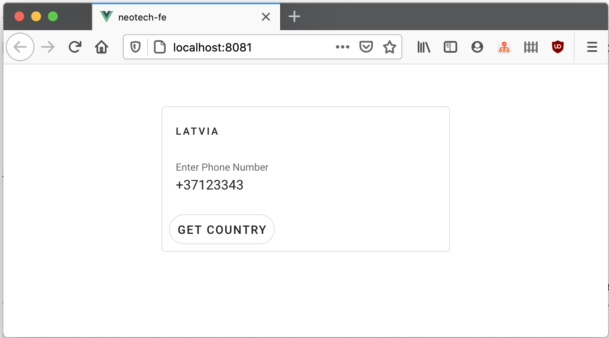

# Task

Функциональные требования:
- Написать микросервис для определения страны по телефонному номеру. 
- Пользователь вводит номер телефона, система валидирует его и показывает страну или сообщение об ошибке.
- Для кодов стран воспользуйтесь таблицой на странице 
  https://en.wikipedia.org/wiki/List_of_country_calling_codes, 
  необходимо загружать из нее данные каждый раз при запуске сервиса.

# Notes

* [x] Приложение должно собираться и запускаться из командной строки, на 8080 порту.

```bash
# Run in development
./gradlew bootRun

# Build
./gradlew bootJar

# Run in production
java -jar build/libs/neotech-0.0.1-SNAPSHOT.jar
```

* [x] Также должна быть возможность запуска тестов и просмотра отчетов по ним.

```
./gradlew test
open build/reports/tests/test/index.html
```

* [x] Все обращения к приложению делаются через RESTful сервис с JSON в качестве формата данных. 

* [x] Внешний вид интерфейса неважен, достаточно опрятного HTML. 

```
cd app
npm install
npm run serve
open http://localhost:8081
```



* [x] Для запросов используйте любой AJAX-capable фреймворк, можно просто JQuery.
    > Используется Vue.js в папке ./app

* [x] Валидация данных, тесты обязательны.

# Improvements

* Improve error handling by removing the violation constraint path
* Re-download country codes on a specific schedule or via an API request
* Add a code quality tools: linting, static analysis, test coverage 